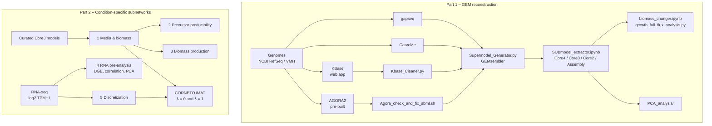

# GEMS-and-Condition-Specific-Subnetworks
Python/Snakemake workflow for building genome-scale metabolic models (GEMs) of 21 gut bacteria (Com21) with AGORA2, KBase, gapseq and CarveMe, merged into consensus supermodels via GEMsembler. Includes FBA, precursor producibility, PCA, and transcriptomics-driven condition-specific subnetworks for B. uniformis and P. vulgatus using CORNETO iMAT.


# Genome-Scale Metabolic Models & Condition-Specific Subnetworks of Gut Bacteria

> Practical course, Zimmermann-Kogadeeva Group, EMBL Heidelberg (05.05.–18.08.2025)
> Author: Valentin Rebernig · Supervisor: Dr. Maria Zimmermann-Kogadeeva

---

## Contents

1. [Workflow overview](#workflow-overview)
2. [Repository structure](#repository-structure)
3. [Requirements](#requirements)
4. [Input data](#input-data)
5. [Part 1 – GEM reconstruction and supermodels](#part-1--gem-reconstruction-and-supermodels)
6. [Part 2 – Condition-specific subnetworks](#part-2--condition-specific-subnetworks)
7. [Known issues and manual interventions](#known-issues-and-manual-interventions)
8. [References](#references)

---

## Workflow overview



---

## Repository structure

```
.
├── 01_GEM_reconstruction/
│   ├── Snakefile_gapseq                    # TODO: re-add (see Step 1a)
│   ├── Snakefile_carveme_NoGap_fill        # TODO: re-add (see Step 1b)
│   ├── Kbase_Cleaner.py                    # removes artificial KBase metabolites
│   ├── Agora_check_and_fix_sbml.sh         # fixes special characters in AGORA2 SBML files
│   ├── Translated_models_code.py           # TODO: describe
│   ├── Supermodel_Generator.py             # GEMsembler supermodel integration
│   ├── SUBmodel_extractor.ipynb            # extracts Core4–Assembly submodels
│   ├── biomass_changer.ipynb               # inserts standardized biomass reaction
│   ├── growth_full_flux_analysis.py        # FBA / growth tests
│   ├── PCA_analysis/                       # PCA of model composition
│   └── lib/                                # helper functions
│
├── 02_Context_specific_subnetworks/
│   ├── 1_Media_and_Biomass_change/
│   │   ├── 1_1_Media_generation.ipynb
│   │   ├── 1_2_biomass_changer.ipynb
│   │   └── LB_minus_O2_media.csv
│   ├── 2_Precursor_Producibility/
│   │   ├── 2_1_Precursor_Producibility_matrix.ipynb
│   │   └── 2_2_Precursor_heatmap.ipynb
│   ├── 3_Biomass/
│   │   ├── 3_1_Biomass_production.ipynb
│   │   └── 3_2_Bar_plot_for_biomass.ipynb
│   ├── 4_RNA_Preanalysis/
│   │   ├── 4_1_Dataframe_extraction.ipynb
│   │   ├── 4_2_Buniformis_PCA_Blotting.ipynb
│   │   ├── 4_2_Pvulgatus_PCA_Blotting.ipynb
│   │   └── 4_3_vulcano_plot.ipynb
│   ├── 5_Transcriptomics_integration/
│   │   ├── 5_1_Buniformis_Expression_Discretization.ipynb
│   │   ├── 5_1_Pvulgatus_Expression_Discretization.ipynb
│   │   ├── Functions.py                    # shared helper functions
│   │   └── lib/
│   ├── Additional_Analysis/                # exploratory, not required for the main results
│   └── lib/
│
├── environment.yml
└── README.md
```

---

## Requirements

| Tool | Purpose | Version |
|---|---|---|
| Python | all analysis | TODO |
| Snakemake | automation of gapseq / CarveMe / GEMsembler runs | TODO |
| [gapseq](https://github.com/jotech/gapseq) | bottom-up reconstruction | TODO |
| [CarveMe](https://github.com/cdanielmachado/carveme) | top-down reconstruction | TODO |
| [GEMsembler](https://github.com/zimmermann-kogadeeva-group/GEMsembler) | supermodel integration | TODO |
| [CORNETO](https://github.com/saezlab/corneto) | network inference (iMAT) | TODO |
| cobrapy | FBA, model handling | TODO |
| MILP solver (e.g. Gurobi / HiGHS) | required by CORNETO iMAT | TODO |
| METAnnotator | protein FASTA for CarveMe | TODO |
| FastANI | selection of replacement strains | TODO |
| pandas, numpy, scipy, scikit-learn, matplotlib, seaborn | analysis and plotting | TODO |

```bash
conda env create -f environment.yml
conda activate gem_workflow
```

KBase is used through its web interface (<https://narrative.kbase.us>) and needs no local installation.

> **Note on paths:** several notebooks contain hardcoded file paths. Adjust them to your local directory structure before running.

---

## Input data

Raw genomes, reconstructed models and transcriptomic data are **not included** in this repository.

| Data | Source |
|---|---|
| Genome assemblies (`.fna`) for gapseq and KBase | [NCBI RefSeq](https://www.ncbi.nlm.nih.gov/refseq/) |
| Protein sequences (`.faa`) for CarveMe | generated from RefSeq assemblies with METAnnotator |
| AGORA2 models (SBML) | [VMH – AGORA2 v2.01](https://www.vmh.life/files/reconstructions/AGORA2/version2.01/sbml_files_fixed/zipped/AGORA2_models/) |
| AGORA2 genome FASTA files | [VMH downloads](https://www.vmh.life/#downloadview) |
| Curated Core3 models of *B. uniformis* and *P. vulgatus* | provided by Elena Matveishina (not public) |
| Normalized transcriptomics, log₂(TPM + 1), grown in mGAM | provided by Juan Escorcia (not public) |

### Species

The 21 species follow the Com21 community (Grießhammer et al., 2023), with *Veillonella parvula* replaced by *Ruminococcus bromii*.

| Species | Strain / RefSeq accession | AGORA2 model | Note |
|---|---|---|---|
| *Bacteroides uniformis* | TODO | TODO | |
| *Phocaeicola vulgatus* | TODO | TODO | |
| *Clostridium saccharolyticum* | TODO | TODO | no FASTA, no replacement strain found |
| *Ruminococcus bromii* | TODO | TODO | replaces *V. parvula* |
| … | | | |

For five AGORA2 strains without an available FASTA file, replacement strains were selected by average nucleotide identity (FastANI). Two of them are below the 95 % ANI threshold. TODO: list them here.

---

## Part 1 – GEM reconstruction and supermodels

All scripts are in `01_GEM_reconstruction/`. Run the steps in this order.

| Step | Script | Input | Output |
|---|---|---|---|
| 1a | `Snakefile_gapseq` | `.fna` genomes | gapseq SBML models |
| 1b | `Snakefile_carveme_NoGap_fill` | `.faa` proteins | CarveMe SBML models |
| 1c | KBase web app + `Kbase_Cleaner.py` | `.fna` genomes | cleaned KBase SBML models |
| 1d | `Agora_check_and_fix_sbml.sh` | AGORA2 SBML from VMH | fixed AGORA2 SBML models |
| 2 | `Translated_models_code.py` | TODO | TODO |
| 3 | `Supermodel_Generator.py` | 4 models per species + genome FASTA | GEMsembler supermodels |
| 4 | `SUBmodel_extractor.ipynb` | supermodels | Core4, Core3, Core2, Assembly and per-tool models |
| 5 | `biomass_changer.ipynb` | submodels + `final_biomass_as_model.xml` | models with standardized biomass |
| 6 | `growth_full_flux_analysis.py` | standardized models | FBA growth and precursor synthesis results |
| 7 | `PCA_analysis/` | all models | PCA of genes, reactions and metabolites |

### Step 1a – gapseq

Automated with Snakemake across all 21 genomes. Equivalent command per genome:

```bash
gapseq doall genome.fna   # TODO: add the exact options used
```

### Step 1b – CarveMe (no gap-filling)

Automated with Snakemake across all 21 genomes. Equivalent command per genome:

```bash
carve proteins.faa -o model.xml   # TODO: add the exact options used; no -g/--gapfill
```

### Step 1c – KBase (manual)

1. Upload the genome `.fna` files to a KBase Narrative.
2. Run **Batch Create Assembly Set** (v1.2.0).
3. Run **Annotate Multiple Microbial Assemblies with RASTtk** (v1.073).
4. Run **MS2 – Build Prokaryotic Metabolic Models** with OMEGGA.
5. Download the SBML models and remove artificial metabolites:

```bash
python Kbase_Cleaner.py   # TODO: arguments
```

### Step 1d – AGORA2

```bash
bash Agora_check_and_fix_sbml.sh   # TODO: arguments
```

### Steps 3–4 – Supermodels and confidence levels

`Supermodel_Generator.py` integrates the four reconstructions per species with GEMsembler and remaps all gene IDs to the genome FASTA. `SUBmodel_extractor.ipynb` then extracts:

| Level | Definition |
|---|---|
| Core4 | features present in all 4 tools |
| Core3 | features present in ≥ 3 tools |
| Core2 | features present in ≥ 2 tools |
| Assembly | features present in ≥ 1 tool |

---

## Part 2 – Condition-specific subnetworks

All scripts are in `02_Context_specific_subnetworks/`. The folders are numbered in run order, and the notebooks within each folder follow the `<folder>_<step>` numbering.

| Step | Notebook | What it does | Output |
|---|---|---|---|
| 1_1 | `1_1_Media_generation.ipynb` | defines the medium | `LB_minus_O2_media.csv` |
| 1_2 | `1_2_biomass_changer.ipynb` | inserts the standardized biomass reaction into the curated Core3 models | standardized models |
| 2_1 | `2_1_Precursor_Producibility_matrix.ipynb` | tests de novo synthesis of each biomass precursor | producibility matrix |
| 2_2 | `2_2_Precursor_heatmap.ipynb` | plots the matrix | heatmap |
| 3_1 | `3_1_Biomass_production.ipynb` | FBA with biomass as the objective | biomass fluxes |
| 3_2 | `3_2_Bar_plot_for_biomass.ipynb` | plots biomass production per model | bar plot |
| 4_1 | `4_1_Dataframe_extraction.ipynb` | loads the expression data and filters it to model genes | expression tables |
| 4_2 | `4_2_<species>_PCA_Blotting.ipynb` | Spearman correlation, PCA, mean–variance plots | figures |
| 4_3 | `4_3_vulcano_plot.ipynb` | differential expression, monoculture vs. co-culture (adj. p < 0.05, \|log₂FC\| > 1) | volcano plots |
| 5_1 | `5_1_<species>_Expression_Discretization.ipynb` | averages replicates, discretizes into −1 / 0 / +1 by quantiles, runs CORNETO iMAT with λ = 0 and λ = 1 | flux tables, heatmaps, PCA |

Conditions: monoculture, co-culture with *B. thetaiotaomicron*, co-culture with *P. vulgatus* (for *B. uniformis*), and the full Com21 community.

**Regularization in iMAT.**
- **λ = 0** fits each condition independently and gives condition-specific subnetworks.
- **λ = 1** penalizes network size across conditions and highlights a conserved core metabolism.

`Additional_Analysis/` contains exploratory notebooks that are not needed to reproduce the main results.

---

## Known issues and manual interventions

- **KBase gene IDs** are not fully compatible with GEMsembler, so gene-level information from KBase models is largely lost in the supermodels.
- **KBase models of *C. saccharolyticum* and *E. bolteae*** failed to integrate and were rebuilt with an older version of the ModelSEED app in KBase.
- ***C. saccharolyticum*** has no AGORA2 genome FASTA and no suitable replacement strain, so its AGORA2 genes could not be mapped.
- **AGORA2 gene names for *S. salivarius* and *E. lenta*** do not match their FASTA files, so few or no genes were mapped.
- **Uncurated models** (all tools and confidence levels) do not produce biomass with the standardized biomass reaction. Only the curated *B. uniformis* model grows, and its growth rate is unrealistically high.
- The automatically generated models were **not manually curated** (mass and charge balance, transport reactions), so treat them as drafts.

---

## References

- Arkin, A.P. et al. (2018) KBase. *Nature Biotechnology* 36, 566–569. https://doi.org/10.1038/nbt.4163
- Grießhammer, A. et al. (2023) Non-antibiotic drugs break colonization resistance against pathogenic Gammaproteobacteria. *bioRxiv*. https://doi.org/10.1101/2023.11.06.564936
- Heinken, A. et al. (2023) AGORA2. *Nature Biotechnology* 41, 1320–1331. https://doi.org/10.1038/s41587-022-01628-0
- Machado, D. et al. (2018) CarveMe. *Nucleic Acids Research* 46, 7542–7553. https://doi.org/10.1093/nar/gky537
- Matveishina, E.K. et al. GEMsembler: cross-tool structural comparison and ensemble modeling improve metabolic model performance.
- Rodriguez-Mier, P. et al. (2024) CORNETO: Unified knowledge-driven network inference from omics data. *bioRxiv*. https://doi.org/10.1101/2024.10.26.620390
- Zimmermann, J., Kaleta, C. & Waschina, S. (2021) gapseq. *Genome Biology* 22, 81. https://doi.org/10.1186/s13059-021-02295-1

## Acknowledgements

Thanks to Dr. Maria Zimmermann-Kogadeeva for supervision, Elena Matveishina for the curated Core3 models and GEMsembler, and Juan Escorcia for the normalized transcriptomic data.

## License

TODO: choose a license (e.g. MIT).
