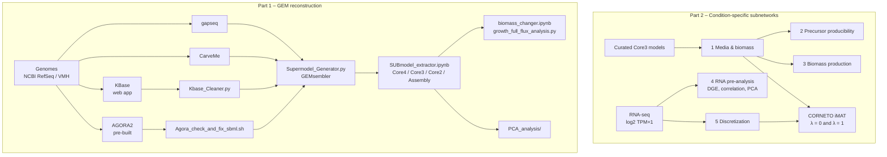

# Genome-Scale Metabolic Models & Condition-Specific Subnetworks of Gut Bacteria

Genome-scale metabolic models (GEMs) predict what a microbe can make and consume from its genome alone. Different reconstruction tools, however, produce quite different models for the same organism. This repository contains the workflow developed during a practical course in the Zimmermann-Kogadeeva group (EMBL, 2025) to:

1. build GEMs for 21 gut bacteria of the synthetic Com21 community with four tools (**AGORA2**, **KBase**, **gapseq**, **CarveMe**),
2. merge them into consensus **supermodels** with **GEMsembler** and extract submodels at different confidence levels,
3. test the models for growth and biomass precursor production, and
4. integrate transcriptomic data with **CORNETO iMAT** to build condition-specific subnetworks of *Bacteroides uniformis* and *Phocaeicola vulgatus* grown alone, in co-culture, and in the Com21 community.


> Practical course, Zimmermann-Kogadeeva Group, EMBL Heidelberg (05.05.–18.08.2025)
> Author: Valentin Rebernig · Supervisor: Dr. Maria Zimmermann-Kogadeeva

---

## Contents

1. [Workflow overview](#workflow-overview)
2. [Repository structure](#repository-structure)
3. [Requirements](#requirements)
4. [Input data](#input-data)
5. [Part 1 – GEM reconstruction and supermodels](#part-1--gem-reconstruction-and-supermodels)
6. [Part 2 – Condition-specific subnetworks](#part-2--condition-specific-subnetworks)
7. [Known issues and manual interventions](#known-issues-and-manual-interventions)
8. [References](#references)

---

## Workflow overview



---

## Repository structure

```
.
├── 01_GEM_reconstruction/
│   ├── Snakefile_gapseq                    # missing
│   ├── Snakefile_carveme_NoGap_fill        # missing
│   ├── Kbase_Cleaner.py                    
│   ├── Agora_check_and_fix_sbml.sh         
│   ├── Supermodel_Generator.py             
│   ├── SUBmodel_extractor.ipynb            
│   ├── biomass_changer.ipynb               
│   ├── growth_full_flux_analysis.py        
│
├── 02_Context_specific_subnetworks/
│   ├── 1_Media_and_Biomass_change/
│   │   ├── 1_1_Media_generation.ipynb
│   │   ├── 1_2_biomass_changer.ipynb
│   │   └── LB_minus_O2_media.csv
│   ├── 2_Precursor_Producibility/
│   │   ├── 2_1_Precursor_Producibility_matrix.ipynb
│   │   └── 2_2_Precursor_heatmap.ipynb
│   ├── 3_Biomass/
│   │   ├── 3_1_Biomass_production.ipynb
│   │   └── 3_2_Bar_plot_for_biomass.ipynb
│   ├── 4_RNA_Preanalysis/
│   │   ├── 4_1_Dataframe_extraction.ipynb
│   │   ├── 4_2_Buniformis_PCA_Blotting.ipynb
│   │   ├── 4_2_Pvulgatus_PCA_Blotting.ipynb
│   │   └── 4_3_vulcano_plot.ipynb
│   ├── 5_Transcriptomics_integration/
│   │   ├── 5_1_Buniformis_Expression_Discretization.ipynb
│   │   ├── 5_1_Pvulgatus_Expression_Discretization.ipynb
│   │   ├── Functions.py                    
└── README.md
```

The following tools need to be installed separately (see their own documentation):

* [gapseq](https://github.com/jotech/gapseq) and [CarveMe](https://github.com/cdanielmachado/carveme) for reconstruction
* [GEMsembler](https://github.com/zimmermann-kogadeeva-group/GEMsembler) for supermodels
* [CORNETO](https://github.com/saezlab/corneto) plus a MILP solver (e.g. Gurobi or HiGHS) for iMAT
* METAnnotator and FastANI for input preparation

KBase is used through its web interface at <https://narrative.kbase.us>.

> **Note:** several notebooks use hardcoded file paths. Adjust them to your folder structure before running.

### Input data

Genomes, models and expression data are **not** included in the repository. Download or request them first:

| Data | Source |
|---|---|
| Genome assemblies (`.fna`) | [NCBI RefSeq](https://www.ncbi.nlm.nih.gov/refseq/) |
| Protein sequences (`.faa`) for CarveMe | generated from the assemblies with METAnnotator |
| AGORA2 models and genome FASTA | [VMH](https://www.vmh.life/#downloadview) |
| Curated Core3 models of *B. uniformis* and *P. vulgatus* | Elena Matveishina (on request) |
| RNA-seq, log₂(TPM + 1), grown in mGAM | Juan Escorcia (on request) |

---

# Part 1: Building GEMs and supermodels

All commands in this part are run from `01_GEM_reconstruction/`.

### Step 1: Reconstruct draft models with four tools

gapseq and CarveMe are run automatically over all 21 genomes with Snakemake:

```bash
# gapseq: bottom-up reconstruction from nucleotide sequences
snakemake -s Snakefile_gapseq 

# CarveMe: top-down reconstruction from protein sequences, without gap-filling
snakemake -s Snakefile_carveme_NoGap_fill 
```


KBase models are built manually in a Narrative with three apps: **Batch Create Assembly Set** (v1.2.0), then **Annotate Multiple Microbial Assemblies with RASTtk** (v1.073), then **MS2 – Build Prokaryotic Metabolic Models** (OMEGGA). KBase adds artificial metabolites, which are removed after download:

```bash
python Kbase_Cleaner.py   # TODO: input/output arguments
```

AGORA2 models are not reconstructed. They are downloaded from VMH, and special characters that break SBML parsing are fixed:

```bash
bash Agora_check_and_fix_sbml.sh   # TODO: input/output arguments
```

At the end of this step there should be four SBML models per species, one per tool.

### Step 2: Build supermodels with GEMsembler

The four models of each species are merged into one supermodel. GEMsembler maps all gene IDs to the genome FASTA so that genes from different tools can be compared:

```bash
python Translated_models_code.py   # TODO: describe what this step does
python Supermodel_Generator.py     # TODO: arguments
```

A supermodel records, for every reaction, metabolite and gene, which tools contain it.

### Step 3: Extract submodels at different confidence levels

Run `SUBmodel_extractor.ipynb`. It extracts the following models from each supermodel:

| Level | Contains features present in |
|---|---|
| Core4 | all 4 tools |
| Core3 | ≥ 3 tools |
| Core2 | ≥ 2 tools |
| Assembly | ≥ 1 tool |

It also extracts the standardized per-tool models. As you move from Core4 to Assembly, the number of genes, reactions and metabolites grows. Confidence goes down, but coverage goes up.

A quick way to inspect any of the extracted models:

```python
import cobra

model = cobra.io.read_sbml_model('B_uniformis_core3.xml')   # example file name
len(model.genes), len(model.reactions), len(model.metabolites)
```

### Step 4: Standardize the biomass and test for growth

Each tool writes its own biomass reaction, so the models cannot be compared directly. `biomass_changer.ipynb` replaces it with one curated biomass reaction taken from `final_biomass_as_model.xml`. Growth is then tested with flux balance analysis:

```bash
python growth_full_flux_analysis.py   # TODO: arguments
```

For a single model, the core of this test is:

```python
solution = model.optimize()
solution.objective_value   # biomass flux; > 0 means the model can grow
```

The result shows which biomass precursors each model can synthesize. Stricter consensus levels (Core4) miss more precursors than the broader Assembly models. CarveMe models produce as many precursors as the consensus models, or more.

### Step 5: Compare models with PCA

The notebooks in `PCA_analysis/` run a PCA on the gene, reaction and metabolite content of all models. This shows whether models cluster by **species** or by **reconstruction tool**. Distant species separate by species. Closely related *Bacteroides* species cluster by tool, which means the tool bias is larger than the biological difference.

---

# Part 2: Condition-specific subnetworks

The folders in `02_Context_specific_subnetworks/` are numbered in run order. Each step is shown for *B. uniformis*. The *P. vulgatus* notebooks work the same way.

### Step 1: Define the medium and biomass

```text
1_Media_and_Biomass_change/1_1_Media_generation.ipynb
1_Media_and_Biomass_change/1_2_biomass_changer.ipynb
```

The first notebook writes `LB_minus_O2_media.csv`, which defines which exchange reactions are open. The second inserts the standardized biomass reaction into the curated Core3 models.

### Step 2: Check which biomass precursors can be produced

```text
2_Precursor_Producibility/2_1_Precursor_Producibility_matrix.ipynb
2_Precursor_Producibility/2_2_Precursor_heatmap.ipynb
```

Each precursor of the biomass reaction is tested on its own as an objective. The heatmap shows producible precursors in green and non-producible ones in light blue. Only the curated model produces all of them, and the Assembly model comes closest.

### Step 3: Test biomass production

```text
3_Biomass/3_1_Biomass_production.ipynb
3_Biomass/3_2_Bar_plot_for_biomass.ipynb
```

FBA is run with biomass as the objective for every model. Only the curated model grows. Its growth rate is unrealistically high, which suggests the biomass composition or uptake bounds need further refinement.

### Step 4: Explore the transcriptomic data

```text
4_RNA_Preanalysis/4_1_Dataframe_extraction.ipynb
4_RNA_Preanalysis/4_2_Buniformis_PCA_Blotting.ipynb
4_RNA_Preanalysis/4_3_vulcano_plot.ipynb
```

`4_1` loads the log₂(TPM + 1) data and keeps only genes that are also in the model (for *B. uniformis*, 3782 genes reduce to 623). `4_2` produces a Spearman correlation matrix, a PCA of the samples, and mean–variance plots. `4_3` compares monoculture against each co-culture (adjusted p < 0.05, |log₂FC| > 1).

To read the results:

* Replicates correlate strongly (ρ ≈ 0.85–1.0).
* The response to *P. vulgatus* is small, the response to *B. thetaiotaomicron* is moderate, and the response in Com21 is extensive.
* On PC1 (59.3 % of variance), Com21 samples separate clearly from all other conditions.

### Step 5: Discretize expression and run CORNETO iMAT

```text
5_Transcriptomics_integration/5_1_Buniformis_Expression_Discretization.ipynb
```

Helper functions are in `Functions.py`. Expression is first averaged across replicates and then split by quantiles into three states:

| State | Meaning |
|---|---|
| −1 | low expression, so the reaction is preferably inactive |
| 0 | medium expression, no preference |
| +1 | high expression, so the reaction is preferably active |

These states are passed to the multi-sample iMAT in CORNETO, run with two regularization settings:

* **λ = 0**: every condition is fitted on its own, which gives condition-specific subnetworks with large differences between conditions.
* **λ = 1**: network size is penalized across all conditions, which highlights a conserved core metabolism shared by all conditions.

The notebook exports the fluxes, scales them to [−1, 1], and plots a clustered heatmap of the 50 most variable reactions together with a PCA of the conditions.

> TODO: confirm that iMAT runs in this notebook. If it runs in a separate script, add it here.

---

## Known issues

* KBase gene IDs are not fully compatible with GEMsembler, so KBase gene information is largely lost.
* The KBase models of *C. saccharolyticum* and *E. bolteae* were rebuilt with an older ModelSEED app because the newer ones failed to integrate.
* *C. saccharolyticum* has no AGORA2 FASTA and no replacement strain. Five other strains were replaced using FastANI, and two of those are below 95 % ANI.
* AGORA2 gene names for *S. salivarius* and *E. lenta* do not match their FASTA files.
* The automatically built models were not manually curated and should be treated as drafts.

## Citation

If you use this workflow, please cite the tools it builds on:

* **AGORA2**: Heinken et al. (2023) *Nat Biotechnol* 41, 1320–1331. https://doi.org/10.1038/s41587-022-01628-0
* **KBase**: Arkin et al. (2018) *Nat Biotechnol* 36, 566–569. https://doi.org/10.1038/nbt.4163
* **gapseq**: Zimmermann, Kaleta & Waschina (2021) *Genome Biol* 22, 81. https://doi.org/10.1186/s13059-021-02295-1
* **CarveMe**: Machado et al. (2018) *Nucleic Acids Res* 46, 7542–7553. https://doi.org/10.1093/nar/gky537
* **GEMsembler**: Matveishina et al. GEMsembler: cross-tool structural comparison and ensemble modeling improve metabolic model performance.
* **CORNETO**: Rodriguez-Mier et al. (2024) *bioRxiv*. https://doi.org/10.1101/2024.10.26.620390
* **Com21**: Grießhammer et al. (2023) *bioRxiv*. https://doi.org/10.1101/2023.11.06.564936
